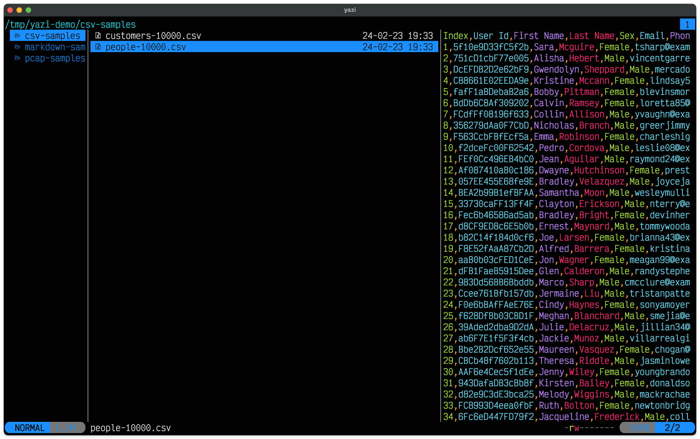
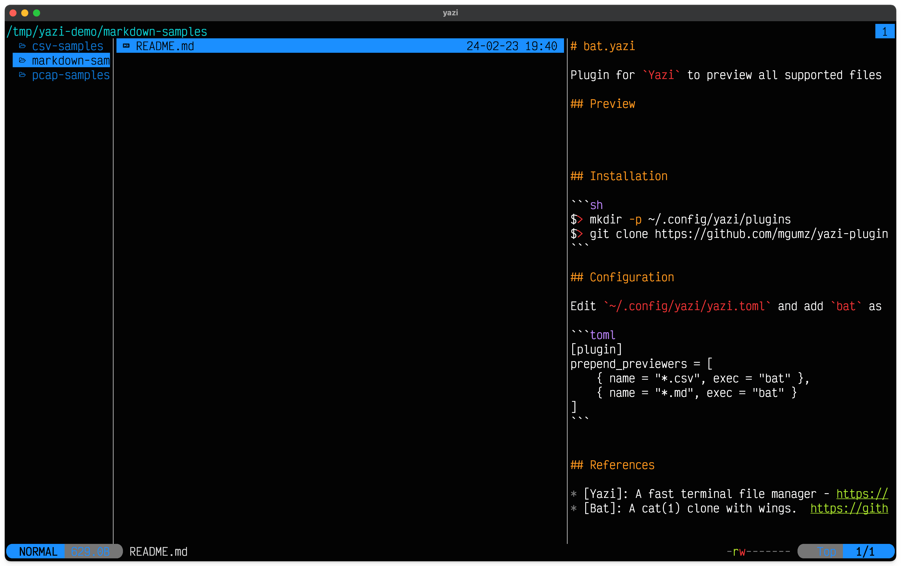
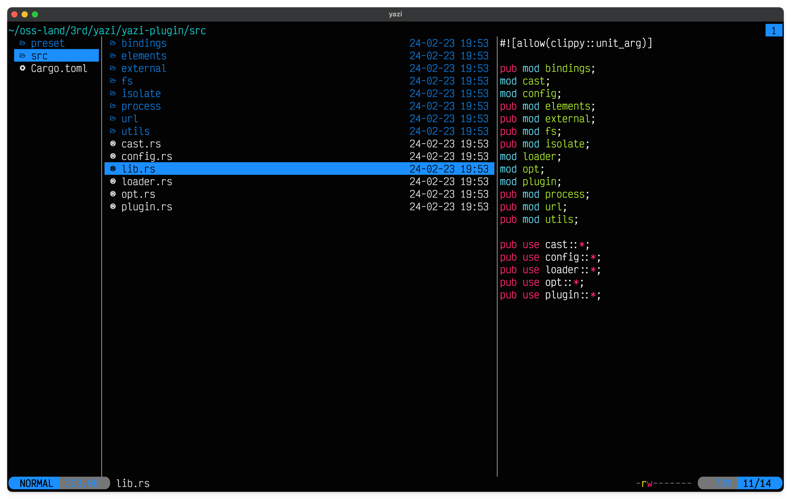

# bat.yazi

Plugin for `Yazi` to preview all supported files via `Bat`.

## Preview

Showing .csv files



Previewing .md files



Previewing .rs files



## Installation

```sh
$> mkdir -p ~/.config/yazi/plugins
$> git clone https://github.com/mgumz/yazi-plugin-bat.git ~/.config/yazi/plugins/bat.yazi
```

## Configuration

Edit `~/.config/yazi/yazi.toml` and add `bat` as the previewer for the file types of your choice.

```toml
[plugin]
prepend_previewers = [
    { name = "*.csv", exec = "bat" },
    { name = "*.md", exec = "bat" }
]
```


## References

* [Yazi - A fast terminal file manager](https://yazi-rs.github.io)
* [Bat - A cat(1) clone with wings](https://github.com/sharkdp/bat)
